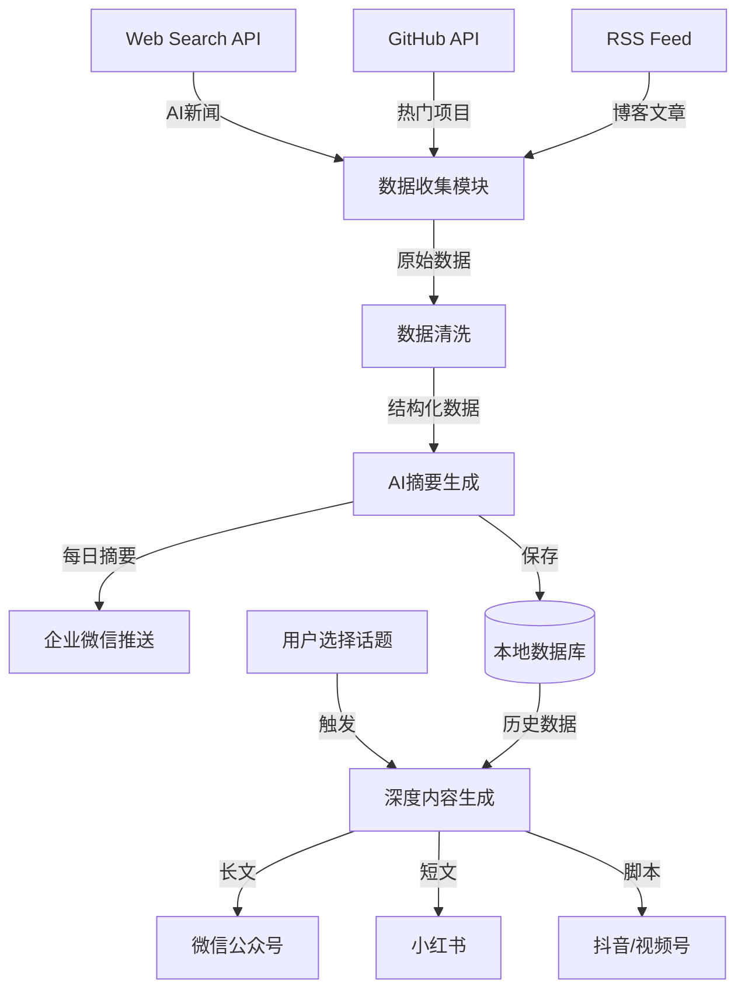

# AI 内容创作自动化工作流配置

## 📋 项目概述
- **项目名称**: AI Content Creation Workflow
- **创建日期**: 2026-02-17
- **目标**: 每日自动收集AI热点 → 生成多平台内容 → 推送通知

---

## 🔄 工作流架构

```
┌─────────────────────────────────────────────────────┐
│  第一阶段：信息收集（每天 07:00 自动执行）           │
├─────────────────────────────────────────────────────┤
│  1. 搜索AI新闻（Web Search API）                     │
│  2. 爬取GitHub Trending（RSS/API）                   │
│  3. 数据清洗与结构化                                 │
│  4. AI摘要生成（Claude/GPT-4）                       │
└─────────────────────────────────────────────────────┘
                        ↓
┌─────────────────────────────────────────────────────┐
│  第二阶段：内容推送（07:30）                         │
├─────────────────────────────────────────────────────┤
│  1. 发送摘要到微信（企业微信机器人）                 │
│  2. 保存原始数据到本地数据库                         │
└─────────────────────────────────────────────────────┘
                        ↓
┌─────────────────────────────────────────────────────┐
│  第三阶段：人工筛选（09:00-10:00）                   │
├─────────────────────────────────────────────────────┤
│  1. 查看推送的摘要                                   │
│  2. 选择感兴趣的话题（回复关键词/标记）              │
└─────────────────────────────────────────────────────┘
                        ↓
┌─────────────────────────────────────────────────────┐
│  第四阶段：内容生成（10:00 触发）                    │
├─────────────────────────────────────────────────────┤
│  1. 深度信息检索（补充资料）                         │
│  2. 生成微信公众号长文（3000-5000字）                │
│  3. 生成小红书短文（500-800字）                      │
│  4. 生成抖音/视频号脚本（60秒）                      │
│  5. 保存到本地文件夹                                 │
└─────────────────────────────────────────────────────┘
                        ↓
┌─────────────────────────────────────────────────────┐
│  第五阶段：内容审核与发布（14:00-17:00）             │
├─────────────────────────────────────────────────────┤
│  1. 人工审阅修改                                     │
│  2. 手动发布到各平台                                 │
│  3. 记录发布数据                                     │
└─────────────────────────────────────────────────────┘
```

---

## 🛠️ 技术栈

### 核心工具
| 组件 | 技术/工具 | 用途 |
|------|----------|------|
| **信息收集** | Web Search API | AI新闻搜索 |
| | GitHub API / RSSHub | GitHub Trending爬取 |
| **内容生成** | Claude API | 深度分析与写作 |
| | OpenAI GPT-4 | 备用写作模型 |
| **定时任务** | Windows Task Scheduler | 本地定时执行 |
| **消息推送** | 企业微信机器人 | 推送每日摘要 |
| **数据存储** | JSON / SQLite | 本地数据库 |
| **视频制作** | 剪映API（未来） | 自动化视频生成 |

### 依赖库（Python）
```python
# requirements.txt
requests==2.31.0
beautifulsoup4==4.12.2
anthropic==0.18.0
openai==1.12.0
feedparser==6.0.10
sqlite3  # Python标准库
schedule==1.2.0
```

---

## 📁 项目目录结构

```
C:\Users\andygzsun\AI_Content_Creation\
│
├── config/                          # 配置文件
│   ├── api_keys.json               # API密钥（加密存储）
│   ├── sources.json                # 数据源配置
│   └── prompts.json                # AI提示词模板
│
├── scripts/                         # 自动化脚本
│   ├── 01_collect_news.py          # 收集AI新闻
│   ├── 02_collect_github.py        # 爬取GitHub Trending
│   ├── 03_generate_summary.py      # 生成每日摘要
│   ├── 04_send_notification.py     # 发送微信通知
│   ├── 05_generate_content.py      # 生成完整内容
│   └── main.py                     # 主控制脚本
│
├── data/                            # 数据存储
│   ├── raw/                        # 原始数据
│   │   ├── 2026-02-17_news.json
│   │   └── 2026-02-17_github.json
│   ├── processed/                  # 处理后数据
│   └── database.db                 # SQLite数据库
│
├── output/                          # 生成的内容
│   └── 2026-02-17_Gemini3_DeepThink/
│       ├── wechat_article.md       # 微信公众号文章
│       ├── xiaohongshu_post.md     # 小红书内容
│       ├── video_script.md         # 视频脚本
│       └── assets/                 # 配图素材
│
├── templates/                       # 内容模板
│   ├── wechat_template.md
│   ├── xiaohongshu_template.md
│   └── video_template.md
│
├── logs/                            # 日志文件
│   └── workflow_2026-02-17.log
│
└── README.md                        # 项目说明文档
```

---

## 🔧 配置文件示例

### 1. 数据源配置 (`config/sources.json`)

```json
{
  "ai_news_sources": [
    {
      "name": "AI News Aggregator",
      "type": "web_search",
      "keywords": [
        "AI breakthrough 2026",
        "OpenAI news latest",
        "Google DeepMind release",
        "Anthropic Claude update",
        "machine learning research"
      ],
      "weight": 0.8
    },
    {
      "name": "Tech News RSS",
      "type": "rss",
      "urls": [
        "https://openai.com/blog/rss.xml",
        "https://www.deeplearning.ai/blog/feed/",
        "https://ai.googleblog.com/feeds/posts/default"
      ],
      "weight": 0.6
    }
  ],
  "github_sources": [
    {
      "name": "GitHub Trending - Python",
      "url": "https://api.github.com/search/repositories?q=language:python+stars:>100+pushed:>2026-02-10&sort=stars&order=desc",
      "language": "python",
      "min_stars": 100
    },
    {
      "name": "GitHub Trending - JavaScript",
      "url": "https://api.github.com/search/repositories?q=language:javascript+ai+machine-learning+stars:>50&sort=stars&order=desc",
      "language": "javascript",
      "min_stars": 50
    }
  ],
  "filters": {
    "exclude_keywords": ["crypto", "blockchain", "NFT"],
    "min_relevance_score": 0.6
  }
}
```

### 2. AI提示词模板 (`config/prompts.json`)

```json
{
  "daily_summary": {
    "system": "你是一个专业的AI科技观察者，擅长从大量信息中提取有价值的内容。",
    "user": "基于以下AI新闻和GitHub项目，生成一份简洁的每日摘要（300字以内），突出最有价值的3个话题：\n\n{content}\n\n要求：\n1. 按重要性排序\n2. 每个话题用一句话概括\n3. 标注信息来源"
  },
  "wechat_article": {
    "system": "你是一个资深的科技自媒体作者，擅长撰写深度分析文章。",
    "user": "基于以下话题，撰写一篇适合微信公众号的深度文章：\n\n【话题】\n{topic}\n\n【要求】\n- 字数：3000-5000字\n- 结构：引言 → 技术解析 → 应用场景 → 行业影响 → 总结\n- 风格：专业但易懂，引用具体数据\n- 包含：小标题、数据对比表格、关键观点总结"
  },
  "xiaohongshu_post": {
    "system": "你是一个年轻的科技博主，擅长用通俗易懂的语言讲解复杂技术。",
    "user": "基于以下话题，撰写一篇小红书风格的内容：\n\n【话题】\n{topic}\n\n【要求】\n- 字数：500-800字\n- 语言：口语化，多用emoji\n- 结构：开场hook → 3个核心观点 → 个人看法 → 互动引导\n- 标签：5-8个相关话题标签"
  },
  "video_script": {
    "system": "你是一个短视频脚本创作专家，擅长在60秒内讲清楚一个技术概念。",
    "user": "基于以下话题，创作一个抖音/视频号的短视频脚本：\n\n【话题】\n{topic}\n\n【要求】\n- 时长：60秒\n- 结构：开场hook（5秒） → 核心内容（50秒） → CTA（5秒）\n- 包含：分镜说明、旁白文案、字幕内容、画面描述\n- 风格：节奏明快，信息密度高"
  }
}
```

### 3. API密钥配置 (`config/api_keys.json`)

```json
{
  "anthropic": {
    "api_key": "YOUR_CLAUDE_API_KEY",
    "model": "claude-3-opus-20240229",
    "max_tokens": 4000
  },
  "openai": {
    "api_key": "YOUR_OPENAI_API_KEY",
    "model": "gpt-4-turbo-preview",
    "max_tokens": 4000
  },
  "github": {
    "token": "YOUR_GITHUB_TOKEN"
  },
  "wechat_bot": {
    "webhook_url": "YOUR_WECHAT_BOT_WEBHOOK"
  }
}
```

**⚠️ 安全提醒**：
- 该文件应加密存储或使用环境变量
- 不要提交到Git仓库（已加入.gitignore）

---

## 🤖 核心脚本代码

### 主控制脚本 (`scripts/main.py`)

```python
#!/usr/bin/env python3
# -*- coding: utf-8 -*-
"""
AI Content Creation Workflow - 主控制脚本
"""

import os
import sys
import json
import logging
from datetime import datetime
from pathlib import Path

# 添加项目根目录到路径
sys.path.insert(0, str(Path(__file__).parent.parent))

# 导入子模块
from scripts.collect_news import collect_ai_news
from scripts.collect_github import collect_github_trending
from scripts.generate_summary import generate_daily_summary
from scripts.send_notification import send_wechat_notification
from scripts.generate_content import generate_full_content

# 配置日志
logging.basicConfig(
    level=logging.INFO,
    format='%(asctime)s - %(levelname)s - %(message)s',
    handlers=[
        logging.FileHandler(f'logs/workflow_{datetime.now().strftime("%Y-%m-%d")}.log'),
        logging.StreamHandler()
    ]
)
logger = logging.getLogger(__name__)

class ContentCreationWorkflow:
    def __init__(self):
        self.base_dir = Path(__file__).parent.parent
        self.today = datetime.now().strftime("%Y-%m-%d")
        self.data_dir = self.base_dir / "data" / "raw"
        self.data_dir.mkdir(parents=True, exist_ok=True)
        
    def step1_collect_data(self):
        """第一步：收集数据"""
        logger.info("=" * 50)
        logger.info("开始执行：第一步 - 收集数据")
        logger.info("=" * 50)
        
        try:
            # 收集AI新闻
            logger.info("正在收集AI新闻...")
            news_data = collect_ai_news()
            news_file = self.data_dir / f"{self.today}_news.json"
            with open(news_file, 'w', encoding='utf-8') as f:
                json.dump(news_data, f, ensure_ascii=False, indent=2)
            logger.info(f"✅ AI新闻收集完成，共 {len(news_data)} 条")
            
            # 收集GitHub项目
            logger.info("正在收集GitHub Trending...")
            github_data = collect_github_trending()
            github_file = self.data_dir / f"{self.today}_github.json"
            with open(github_file, 'w', encoding='utf-8') as f:
                json.dump(github_data, f, ensure_ascii=False, indent=2)
            logger.info(f"✅ GitHub项目收集完成，共 {len(github_data)} 个")
            
            return news_data, github_data
            
        except Exception as e:
            logger.error(f"❌ 数据收集失败：{str(e)}")
            raise
    
    def step2_generate_summary(self, news_data, github_data):
        """第二步：生成每日摘要"""
        logger.info("=" * 50)
        logger.info("开始执行：第二步 - 生成摘要")
        logger.info("=" * 50)
        
        try:
            summary = generate_daily_summary(news_data, github_data)
            logger.info("✅ 每日摘要生成完成")
            return summary
        except Exception as e:
            logger.error(f"❌ 摘要生成失败：{str(e)}")
            raise
    
    def step3_send_notification(self, summary):
        """第三步：发送微信通知"""
        logger.info("=" * 50)
        logger.info("开始执行：第三步 - 发送通知")
        logger.info("=" * 50)
        
        try:
            send_wechat_notification(summary)
            logger.info("✅ 微信通知发送成功")
        except Exception as e:
            logger.error(f"❌ 通知发送失败：{str(e)}")
            raise
    
    def step4_generate_content(self, topic):
        """第四步：生成完整内容（需要人工触发）"""
        logger.info("=" * 50)
        logger.info("开始执行：第四步 - 生成完整内容")
        logger.info("=" * 50)
        
        try:
            content_package = generate_full_content(topic)
            logger.info("✅ 完整内容生成成功")
            return content_package
        except Exception as e:
            logger.error(f"❌ 内容生成失败：{str(e)}")
            raise
    
    def run_daily_collection(self):
        """每日定时执行：数据收集+摘要推送"""
        logger.info(f"🚀 开始执行每日工作流：{self.today}")
        
        try:
            # 步骤1：收集数据
            news_data, github_data = self.step1_collect_data()
            
            # 步骤2：生成摘要
            summary = self.step2_generate_summary(news_data, github_data)
            
            # 步骤3：发送通知
            self.step3_send_notification(summary)
            
            logger.info("🎉 每日工作流执行完成！")
            return True
            
        except Exception as e:
            logger.error(f"💥 工作流执行失败：{str(e)}")
            return False
    
    def run_content_generation(self, topic_index=0):
        """人工触发：根据选定话题生成内容"""
        logger.info(f"🎨 开始生成内容（话题索引：{topic_index}）")
        
        try:
            # 读取今日数据
            news_file = self.data_dir / f"{self.today}_news.json"
            github_file = self.data_dir / f"{self.today}_github.json"
            
            with open(news_file, 'r', encoding='utf-8') as f:
                news_data = json.load(f)
            with open(github_file, 'r', encoding='utf-8') as f:
                github_data = json.load(f)
            
            # 选择话题（默认选择第一个）
            if topic_index < len(news_data):
                topic = news_data[topic_index]
            else:
                topic = github_data[topic_index - len(news_data)]
            
            # 生成完整内容
            content_package = self.step4_generate_content(topic)
            
            logger.info("🎉 内容生成完成！")
            return content_package
            
        except Exception as e:
            logger.error(f"💥 内容生成失败：{str(e)}")
            return None

def main():
    """主函数"""
    workflow = ContentCreationWorkflow()
    
    # 判断运行模式
    import sys
    if len(sys.argv) > 1:
        if sys.argv[1] == "collect":
            # 定时任务：每日收集
            workflow.run_daily_collection()
        elif sys.argv[1] == "generate":
            # 手动触发：生成内容
            topic_index = int(sys.argv[2]) if len(sys.argv) > 2 else 0
            workflow.run_content_generation(topic_index)
    else:
        # 默认：只执行收集任务
        workflow.run_daily_collection()

if __name__ == "__main__":
    main()
```

---

## ⏰ 定时任务设置

### Windows Task Scheduler 配置

#### 任务1：每日数据收集
- **名称**: AI_Content_DailyCollection
- **触发器**: 每天 07:00
- **操作**: 运行 PowerShell 脚本
  ```powershell
  cd C:\Users\andygzsun\AI_Content_Creation
  python scripts\main.py collect
  ```
- **条件**: 
  - ✅ 只在计算机使用交流电源时启动
  - ✅ 网络连接可用时运行

#### 任务2：内容生成（手动触发）
- **名称**: AI_Content_Generate
- **触发器**: 手动
- **操作**: 运行 PowerShell 脚本
  ```powershell
  cd C:\Users\andygzsun\AI_Content_Creation
  python scripts\main.py generate 0
  ```

---

## 📊 数据流图



---

## 🎯 下一步行动计划

### 立即执行（今天）
- [x] ✅ 完成首次内容生成（Gemini 3 Deep Think话题）
- [ ] 🔄 安装Python依赖库
- [ ] 🔄 配置API密钥
- [ ] 🔄 测试数据收集脚本

### 本周完成
- [ ] 编写完整的Python脚本
- [ ] 设置Windows定时任务
- [ ] 测试完整工作流
- [ ] 优化AI提示词

### 本月完成
- [ ] 集成视频自动生成（剪映API）
- [ ] 建立内容效果追踪系统
- [ ] 优化算法（自动筛选热门话题）
- [ ] 开发Web界面（方便操作）

---

## 📈 成功指标

### 短期目标（1个月）
- 每周产出 **3-5篇** 高质量内容
- 微信公众号阅读量 **1000+/篇**
- 小红书点赞量 **100+/篇**
- 视频播放量 **5000+/条**

### 中期目标（3个月）
- 建立稳定的粉丝基础（**1000+关注者**）
- 形成个人IP品牌
- 实现广告变现（月收入 **1000+元**）

### 长期目标（6个月）
- 全平台粉丝 **10000+**
- 月收入 **5000+元**
- 可能的合作机会（品牌推广、知识付费）

---

## 🔒 安全与备份

### 数据备份策略
- **频率**: 每周日自动备份
- **位置**: 
  - 本地：D:\Backup\AI_Content_Creation\
  - 云端：OneDrive / 百度网盘
- **保留期限**: 3个月

### API密钥安全
- 使用环境变量存储
- 加密配置文件
- 定期轮换密钥（每3个月）

---

## 📞 技术支持

### 遇到问题？
1. 查看日志文件：`logs/workflow_YYYY-MM-DD.log`
2. 检查API配额是否用尽
3. 验证网络连接
4. 查看GitHub Issues（未来建立）

---

**工作流配置完成！准备开始自动化内容创作之旅！** 🚀