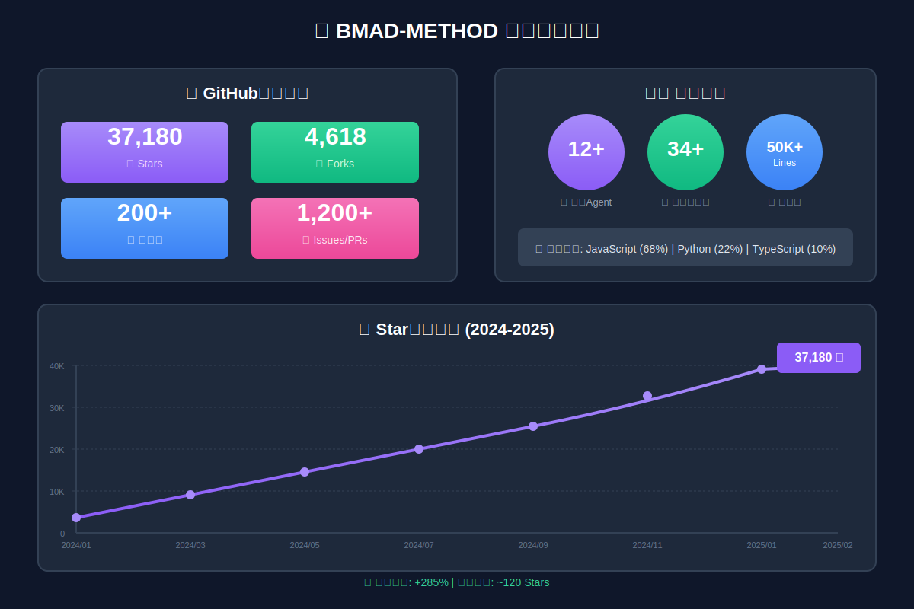
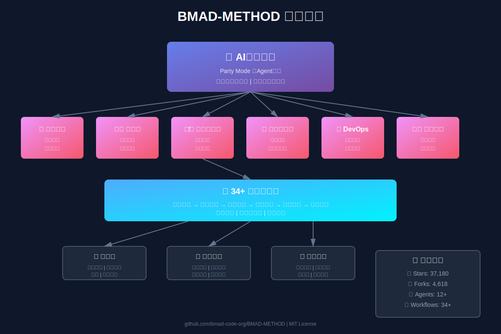
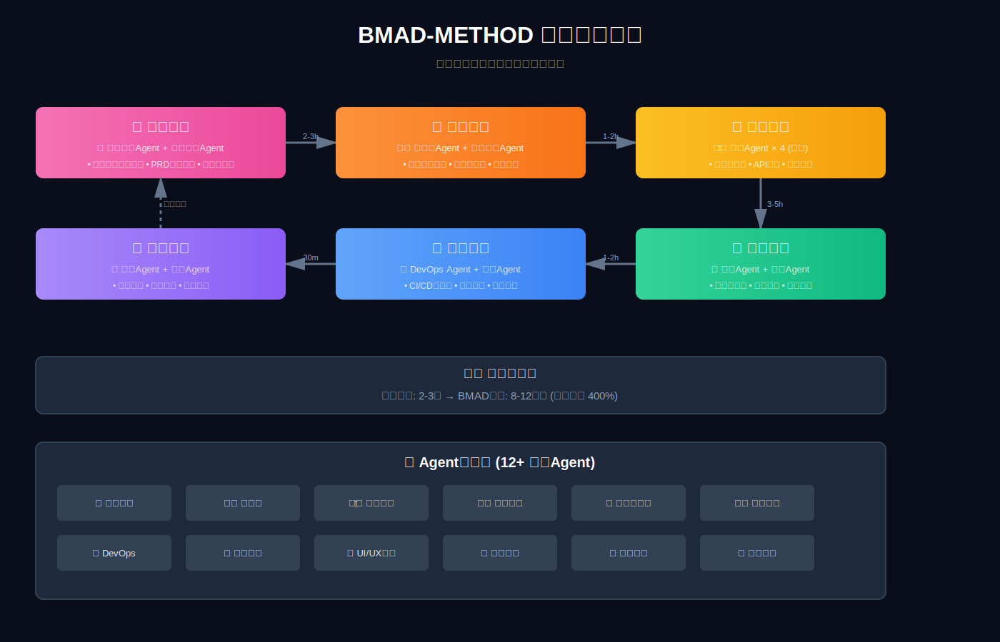
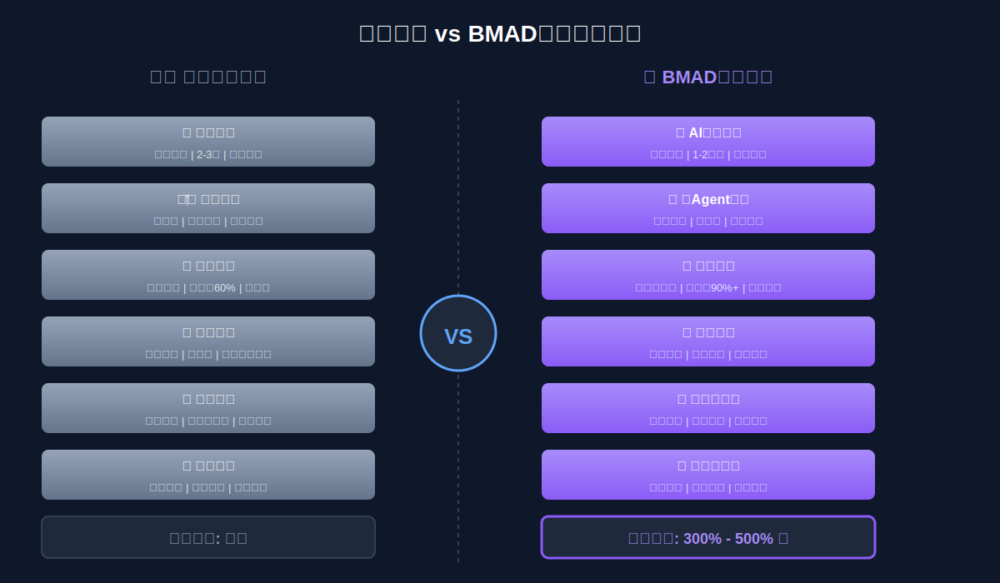

# BMAD-METHOD：重新定义AI辅助开发的正确姿势

> 当AI工具都在"代替你思考"时，有一个项目选择了另一条路：让AI成为你的专家顾问团。

## 引子：37000+ Star背后的思考



在GitHub上，一个名为BMAD-METHOD的项目正在悄然改变开发者对AI工具的认知。**37,180个star**、**4,618个fork**——这些数字背后，是一个关于"AI应该如何辅助开发"的深刻反思。

大多数AI编程工具的逻辑很简单：你说需求，它生成代码。但BMAD-METHOD的创始人提出了一个尖锐的问题：

**"如果AI替你思考，你得到的只能是平庸的结果。"**

这句话戳中了当前AI辅助开发的痛点：Copy-Paste式的代码生成、缺乏架构思考的快餐式开发、AI"黑盒"带来的不可控风险。

## 什么是BMAD-METHOD？

**BMAD** = **B**reakthrough **M**ethod of **A**gile **A**I **D**riven Development

这是一个**完全免费开源**的AI驱动敏捷开发框架，核心理念是：

> AI不应该替你思考，而应该作为**专家协作者**，通过结构化的流程引导你产生最佳思维。

### 核心亮点



#### 1. 规模自适应智能
传统工具对修复一个bug和构建企业系统用同样的方式。BMAD会根据项目复杂度自动调整规划深度：
- 简单bug修复：快速直达解决方案
- 中型功能：适度的设计与规划
- 企业级系统：完整的架构设计与迭代计划

#### 2. 12+领域专家Agent
不是一个万能AI，而是一个专家团队：
- **产品经理**：需求分析与优先级排序
- **架构师**：系统设计与技术选型
- **开发者**：代码实现与最佳实践
- **UX设计师**：用户体验优化
- **Scrum Master**：敏捷流程管理
- **测试架构师**：测试策略与自动化
- 还有DevOps、安全专家、数据工程师...

#### 3. Party Mode：AI圆桌会议
想象这样的场景：
```
你：这个功能用微服务还是单体架构？
[架构师]：考虑你的团队规模和技术栈，我建议...
[DevOps]：从运维角度，我担心...
[开发者]：实现复杂度方面...
[产品经理]：商业价值上看...
```

多个AI角色在同一会话中讨论，从不同专业视角碰撞想法。

#### 4. 结构化工作流
34+内置工作流覆盖完整开发生命周期：
- **分析阶段**：需求分析、用户故事、风险评估
- **规划阶段**：Sprint规划、架构设计、技术选型
- **实现阶段**：TDD开发、代码审查、重构
- **交付阶段**：CI/CD、部署策略、监控

每个流程都基于敏捷最佳实践，不是简单的代码生成。



#### 5. 智能帮助系统
不知道下一步做什么？输入 `/bmad-help` 即可：
```bash
> /bmad-help

📍 当前状态：架构设计已完成
✅ 建议的下一步：
  1. 创建数据模型 (必需)
  2. 设置开发环境 (必需)
  3. 编写API接口文档 (可选)
  
💡 你也可以问我：
  - "我刚完成架构，接下来做什么？"
  - "如何开始测试驱动开发？"
```

## 技术实现：简洁而强大

### 安装与使用

**前置要求**：Node.js v20+

```bash
# 交互式安装
npx bmad-method install

# 非交互式安装（CI/CD友好）
npx bmad-method install \
  --directory /path/to/project \
  --modules bmm \
  --tools claude-code \
  --yes
```

安装后在你的AI IDE（Claude Code、Cursor等）中打开项目文件夹即可使用。

### 模块化架构

BMAD采用模块化设计，核心模块之外可扩展专业领域：

| 模块 | 用途 | 工作流数量 |
|------|------|-----------|
| **BMM** (核心) | 通用敏捷开发框架 | 34+ |
| **BMad Builder** | 自定义Agent和工作流 | - |
| **Test Architect** | 基于风险的测试策略 | 专业测试流程 |
| **Game Dev Studio** | 游戏开发（Unity/Unreal/Godot） | 游戏专用流程 |
| **Creative Intelligence Suite** | 创新、头脑风暴、设计思维 | 创意工作流 |

### 技术栈与兼容性

- **语言**：JavaScript/Node.js
- **兼容IDE**：Claude Code、Cursor、Continue等主流AI编辑器
- **开源协议**：MIT License（真正的自由使用）

## 为什么BMAD不同？

### 对比传统AI编程助手



| 维度 | 传统AI工具 | BMAD-METHOD |
|------|-----------|------------|
| **工作方式** | 代替你思考 | 引导你思考 |
| **输出结果** | 代码片段 | 完整开发方案 |
| **适用范围** | 单一场景 | 全生命周期 |
| **可控性** | 黑盒生成 | 结构化流程 |
| **学习曲线** | 低（但天花板也低） | 适中（上限极高） |

### 真实使用场景

#### 场景1：从零到一的新项目
```
1. 需求分析阶段
   → 产品经理Agent自动分析用户需求
   → 业务分析Agent生成PRD文档
   → 自动完成优先级评估（1-2小时）
   
2. 架构设计阶段
   → 架构师Agent设计系统方案
   → 技术专家Agent完成技术选型
   → 自动生成性能预估报告（1-2小时）
   
3. 并行开发阶段
   → 4个开发Agent同时编码（前端/后端/API）
   → 自动编写单元测试
   → 实时代码审查（3-5小时）
   
4. 自动化验证
   → 测试Agent执行性能测试
   → 安全Agent完成安全扫描
   → 生成测试报告（2小时）
```

#### 场景2：遗留系统重构
```
1. 代码分析
   → 数据分析Agent扫描现有代码库
   → 自动识别技术债务和风险点
   → 生成重构优先级列表
   
2. 制定策略
   → 架构师Agent设计重构方案
   → DevOps Agent规划灰度发布策略
   → 确保业务连续性
   
3. 渐进式重构
   → 测试Agent先建立测试覆盖
   → 开发Agent分模块重构代码
   → 监控Agent实时追踪系统指标
   
4. 持续优化
   → 运维监控Agent收集性能数据
   → AI自动调整优化参数
   → 形成知识库供后续项目使用
```

#### 场景3：技术决策
```
你：微服务 vs 单体架构怎么选？

/party-mode --agents architect,devops,developer

[架构师]：让我们从系统规模、团队结构、技术债务三个维度分析...
[DevOps]：运维角度我需要考虑...
[开发者]：开发效率和维护成本上...

→ 得到多角度的深度分析，而不是简单的"建议用XXX"
```

## 社区与生态

### 活跃的社区

- **Discord**：实时帮助与交流（无付费墙）
- **YouTube**：教程、大师班、播客（2025年2月启动）
- **GitHub Discussions**：深度讨论
- **完整文档**：docs.bmad-method.org

### 真正的开源精神

项目文档开宗明义：
> **100%免费开源。无付费墙。无封闭内容。无付费Discord。**
> 我们相信赋能所有人，而不仅是付费用户。

这在当前充斥着"开源但核心功能收费"项目的环境中尤为难得。

## V6版本：正在发生的进化

最新的V6版本带来重大更新：

- ✅ **跨平台Agent团队**：不同IDE/工具间的Agent协作
- ✅ **子Agent架构**：Agent可以召唤专门的子Agent处理特定任务
- ✅ **技能系统**：可插拔的能力模块
- ✅ **BMad Builder v1**：可视化创建自定义工作流
- 🚧 **Dev Loop自动化**：正在开发中

[完整Roadmap](http://docs.bmad-method.org/roadmap/)

## 适合谁使用？

### 强烈推荐
- **独立开发者**：一个人也能拥有"专家团队"
- **小型团队**：补齐缺失的专业角色
- **技术Leader**：建立规范化的开发流程
- **学习者**：在AI协作中学习最佳实践

### 可能不适合
- 只想要快速代码生成的场景（虽然BMAD也能做到）
- 不认同结构化流程的开发风格
- 团队已有成熟流程且不愿改变

## 实战建议

### 新手入门路径
1. **从简单场景开始**：用 `/bmad-help` 解决一个小任务
2. **尝试Party Mode**：召唤2-3个Agent讨论一个技术决策
3. **体验完整流程**：从头到尾走一遍小型项目开发
4. **自定义工作流**：用BMad Builder创建团队专属流程

### 避坑指南
- ❌ 不要把它当成"更聪明的GitHub Copilot"
- ❌ 不要跳过流程直接要代码
- ✅ 把它当成你的虚拟CTO/架构师/顾问团
- ✅ 多用 `/bmad-help` 了解推荐的工作方式

## 技术思考：AI工具的未来方向

BMAD-METHOD代表了一种趋势：**从"AI生成"到"AI协作"**

### 当前主流AI工具的问题
1. **过度自动化**：让人失去思考能力
2. **缺乏上下文**：不理解项目的完整生命周期
3. **单一视角**：只有"写代码"这一个角度
4. **难以掌控**：不知道AI为什么这样做

### BMAD的解决方案
1. **引导式思考**：AI提出问题，你做决策
2. **全局视野**：从需求到部署的完整支持
3. **多角色协作**：模拟真实团队的讨论
4. **透明流程**：每一步都知道为什么这样做

这种理念在2026年初看起来可能"低效"，但长期来看：
- **个人能力提升**：不会因依赖AI而退化
- **代码质量**：不是生成的，是设计出来的
- **系统稳定性**：有架构思考的代码才能长久
- **团队一致性**：统一的方法论和工作流

## 结语：AI时代的正确打开方式

当Cursor、GitHub Copilot、Claude Code等工具让"AI写代码"成为日常，BMAD-METHOD提醒我们：

**真正的生产力提升，不是让AI替你工作，而是让AI帮你更好地工作。**

37,000+开发者的选择证明：越来越多的人认识到，我们需要的不是"更快的代码生成器"，而是"更智慧的协作伙伴"。

如果你也认同"AI应该让人更强，而非替代人"的理念，BMAD-METHOD值得一试。

---

## 快速开始

```bash
# 一行命令，开启新的开发方式
npx bmad-method install

# 安装后输入
/bmad-help

# 开始你的第一次AI协作
```

## 相关资源

- **GitHub仓库**：https://github.com/bmad-code-org/BMAD-METHOD
- **官方文档**：http://docs.bmad-method.org
- **Discord社区**：https://discord.gg/gk8jAdXWmj
- **YouTube频道**：https://www.youtube.com/@BMadCode

## 项目数据

- **Star数**：37,180（持续增长）
- **Fork数**：4,618
- **开源协议**：MIT License
- **主要语言**：JavaScript
- **Node.js要求**：v20+
- **创建时间**：2025年4月
- **最新更新**：2026年2月（V6版本）

---

**注**：本文基于2026年2月的项目状态撰写，部分功能可能随版本更新而变化。建议查阅[官方文档](http://docs.bmad-method.org)获取最新信息。

**一句话总结**：BMAD-METHOD是一个让AI成为你的专家顾问团的开发框架，而不是代替你思考的代码生成器。